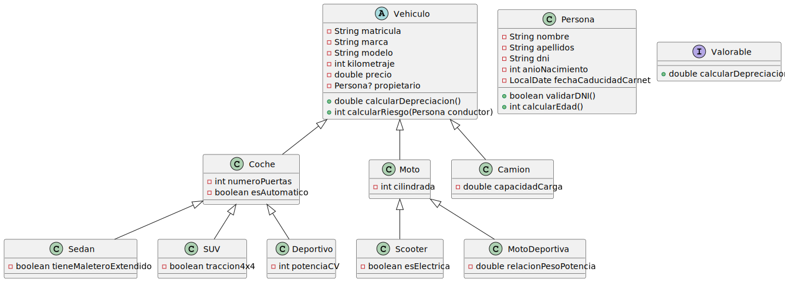

UT5_ED_Prog

TAREAS

- [x] Crear repositorio y estructura de carpetas
- [x] Añadir archivo README.md
- [ ] Modelar clase abstracta `Vehiculo`
- [ ] Modelar subclases `Coche`, `Moto`, `Camion`
- [ ] Añadir subtipos específicos de `Coche` y `Moto`
- [ ] Crear clase `Persona` con validación de DNI
- [ ] Definir interfaz `Valorable`
- [ ] Modelar relaciones (herencia, composición)
- [ ] Implementar cálculo de riesgo
- [ ] Generar UML en SVG con PlantUML
- [ ] Insertar UML en README.md

DIAGRAMA UML

